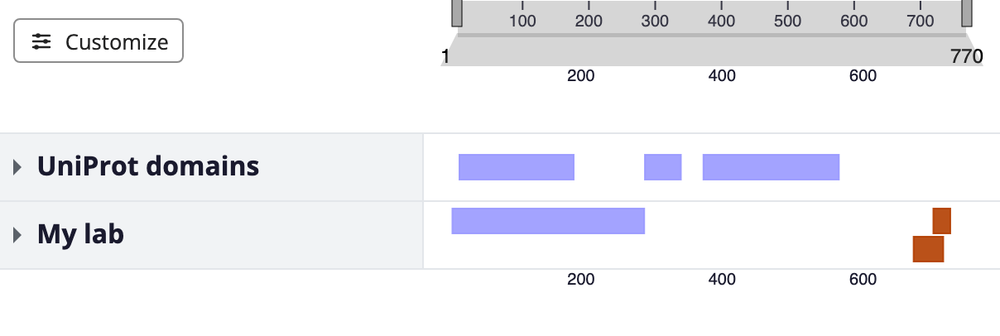
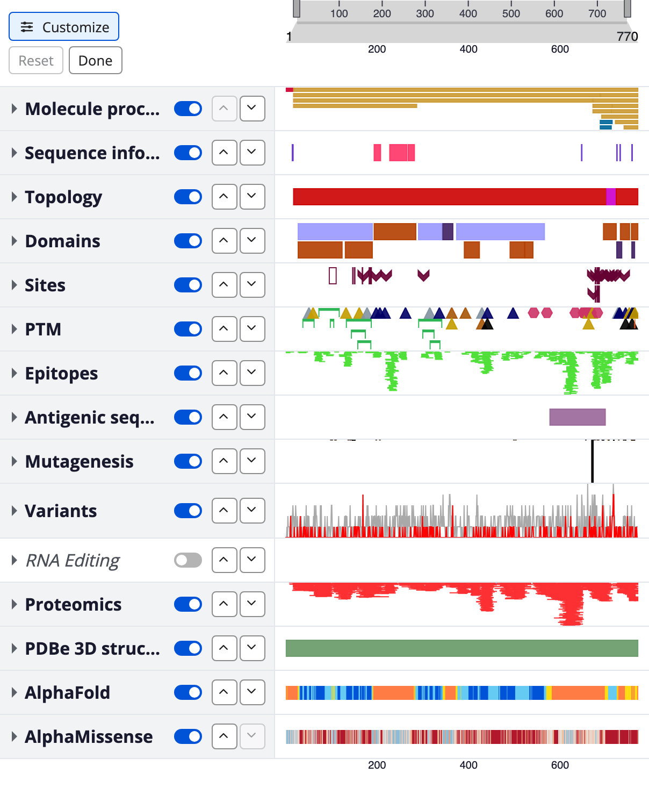

Research groups in protein science keep annotations of their own: hotspot
regions, custom domain calls, lab-specific variant lists. They usually sit in a
spreadsheet, away from the sequence context that makes them mean something.

ProtVista 5, now in beta, puts them on screen: alongside UniProt's domains and
variants, or on their own. It is for scientists, bioinformaticians, and
developers alike, and needs very little code. Everything below takes a short
text file, a button, or a copy of a ready-made page.

ProtVista is free and open source, and anyone can contribute. Version 5 includes
work from outside our team. Thank you to
[Jishanahmed AR Shaikh](https://github.com/jishanahmed-shaikh), who made the
code more reliable and easier to maintain, and to
[Epi-Lo](https://github.com/Epi-Lo), who took on the same problem.

:::tip[Bring your data to the ProtVista hackathon: 7–9 October 2026]
Three free days online, working directly with the developers to get your own
datasets into ProtVista and shape how they are visualised. **30 places, first
come first served. Applications close 1 October 2026.**

[Apply now](https://www.ebi.ac.uk/training/events/protvista-hackathon/) ·
[More about the hackathon](#hackathon-visualise-your-own-data)
:::



_Your own annotations beside UniProt's, from one configuration file._

## Load your own data

Save your annotations as CSV, TSV, JSON, or BED, then point to them from a short
configuration file. The file extension tells ProtVista how to read your data, so
there is nothing else to set up:

```yaml
accession: P05067
rows:
  - id: hotspots
    label: Hotspots
    kind: features
    data: ./hotspots.csv
```

That is the whole change, and it gives you a viewer with just your own track on
it. Add an `extends:` line and the same track sits alongside everything UniProt
already shows. Either way the file works whether you are looking at one protein
or a hundred, and nothing assumes EMBL-EBI as the source, so a group with its own
database can point at that instead.

**Learn more:** [Load your own data](/protvista/your-data) covers all four
formats and every field you can use.
[Author a config](/protvista/configure) covers `extends:` and how the two
configurations merge.

## Rearrange what you see

ProtVista now has a **Customize** button. Click it and each row gains move-up
and move-down buttons and a show/hide switch: reorder groups, reorder tracks
within a group, hide what you don't need. No configuration file, no code, and
nothing to drag, so it works the same with a mouse, a touchscreen, or a
keyboard.

The arrangement sticks: it is still there next time you open that viewer, and
you can share it as a link, so "move Variants above Domains" becomes something
you send rather than something you explain.

**Learn more:** [Customize the layout](/protvista/customize-layout).



_Customize mode: reorder and hide rows without touching a configuration file._

## Try it now, then publish it

The [playground](/protvista/playground/) is an editor beside a live viewer, with
nothing to install. Type an accession, edit the configuration, watch the
visualisation change. Every view has its own web address, so you can send a
colleague exactly what you are looking at.

When you want to keep it, the
[Starter Kit](https://github.com/ebi-webcomponents/protvista-starter-kit) is a
page and a configuration already wired together: select **Use this template**,
put your data file in the `data` folder, edit `config.yaml`, and switch on
GitHub Pages. That
gives you a web page you can share, with nothing installed. Your configuration
is checked each time you save a change, so a mistyped field is flagged there and
then rather than leaving you with an empty track and no explanation.

## Getting it

The playground and the Starter Kit need nothing installed. If you embed
ProtVista in your own site, this release is on npm under the `beta` tag:

```sh
npm install protvista-uniprot@beta
```

It is a beta on purpose. The stable 4.9 release stays the default, so nothing
you already have will change, and the configuration format may still shift
before 5.0 is final. If you are building on it now, we would particularly like
to hear from you.

## Hackathon: visualise your own data

Bring us an idea: a dataset you want to see on screen, a figure you need for a
paper, a way to show your group's data next to UniProt's. Everyone is welcome,
whether or not you have used ProtVista before, and you do not need to have
contributed to the project.

|                        |                             |
| ---------------------- | --------------------------- |
| **Dates**              | 7–9 October 2026            |
| **Format**             | Online, free                |
| **Places**             | 30, first come first served |
| **Applications close** | 1 October 2026              |

[Apply for the hackathon](https://www.ebi.ac.uk/training/events/protvista-hackathon/)

## Where to go next

- [Tutorial](/protvista/tutorial) — from an empty page to your own viewer, in four steps.
- [Load your own data](/protvista/your-data) — CSV, TSV, JSON, and BED, field by field.
- [Customize the layout](/protvista/customize-layout) — reorder, hide, and share the result.
- [Author a config](/protvista/configure) — what goes in the configuration file.
- [Match your site's style](/protvista/theming) — set the colours to match your own pages.
- [Playground](/protvista/playground/) — try changes live and share them by link.
- [Starter Kit](https://github.com/ebi-webcomponents/protvista-starter-kit) — use the template, add your data, publish.
- [Source and issues](https://github.com/ebi-webcomponents/protvista) — questions, bugs, and feature requests.
- [Office hours](https://github.com/ebi-webcomponents/protvista/blob/next/CONTRIBUTING.md#office-hours) — monthly live help with setup and your own data, no registration needed.

A prerecorded [webinar](/protvista/webinar) covering the same ground in more depth is available.

---

_30 July 2026._

This work was supported by the Research Software Maintenance Fund, managed by
the Software Sustainability Institute and funded by UKRI grant reference
AH/Z000114/1.

Code is licensed under the MIT License; documentation and sample data are
licensed under [CC BY 4.0](https://creativecommons.org/licenses/by/4.0/).
