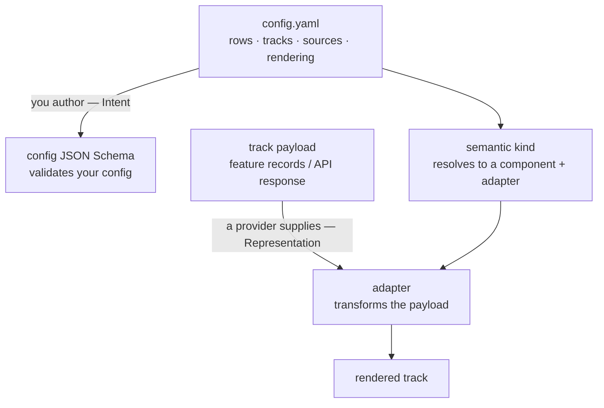

ProtVista draws a deliberate line between two things, and knowing which side of the line you're on saves a lot of confusion when you bring your own data.

**Viewer configuration** is what to show and how: the rows and tracks, where each track's data comes from, and how it's rendered. You author this as a YAML/JSON config, and it's validated by the [config JSON Schema](https://ebi-webcomponents.github.io/protvista/schema/v1/config.schema.json).

**Track payloads** are the data itself, the shape each track actually consumes (a list of feature records, an API response, and so on). A data provider supplies this, either UniProt's API you point at or a file you author. The config schema names adapters and kinds but does not define payload shapes; those are documented in the [adapter reference](/protvista/adapter-reference).

This is the Intent / Representation split. The normative definition lives in [`specs/config-approach.md`](https://github.com/ebi-webcomponents/protvista/blob/next/specs/config-approach.md); this page is the user-facing version.

## The boundary at a glance



**What your configuration controls (Intent)**

- Which rows and tracks appear, their labels and grouping.
- The semantic `kind` of each track (`features`, `variants`, `confidence-score`, …). This is a domain concept, not a component or adapter name.
- Where the data comes from: `data:` with `from: url` / `file` / `inline` / `custom`, and named `sources`.
- Rendering: `color`, `shape`, `height`, `layout`, `colorScale`.
- Convenience shortcuts, such as a single-type `filter:` and `dataTooltip` templates.

**What a data provider supplies (Representation)**

The actual payload each track consumes. For a built-in kind that's a UniProt API response the adapter transforms; for bring-your-own-data it's a file whose fields you author. The per-adapter shapes are documented in the [adapter reference](/protvista/adapter-reference). Bring-your-own-data authors mainly need the generic feature record (`type`, `start`, `end`, optional `description`/`score`); a machine-readable schema is served at [`feature-record.schema.json`](https://ebi-webcomponents.github.io/protvista/schema/v1/feature-record.schema.json).

The **bridge** between the two sides is the `data` descriptor plus the `kind`: your config declares *where* the data is and *which* adapter (directly, or via the kind) turns it into a payload the track renders.

## A paired example

Configuration and payload, side by side — the [`examples/csv`](https://github.com/ebi-webcomponents/protvista/tree/next/examples/csv) example. The config is what **you configure**; the CSV is the **payload you supply**.

`config.yaml` — Intent (a standalone bring-your-own-data track):

```yaml
accession: P05067
rows:
  - id: hotspots
    label: Hotspots
    kind: features
    data: ./hotspots.csv
    description: Hotspot regions identified by our lab's pipeline
```

`hotspots.csv` — Representation (the feature-record payload):

```csv
type,start,end,description,score
DOMAIN,18,289,Extracellular domain (custom re-annotation),0.95
BINDING,132,140,Predicted heparin-binding site,0.87
REGION,290,340,Acidic-rich linker region,0.6
MUTAGEN,614,614,Lab-observed loss-of-function point mutation,0.75
```

The config never describes the CSV's columns — that contract belongs to the payload side. The `.csv` extension selects the `features-csv` adapter, which parses the file into feature records the `features` track renders. Swap `./hotspots.csv` for a URL and the same track reads the same shape from a server instead; the Intent is unchanged.

## Where to go next

- [Adapter reference](/protvista/adapter-reference) — the expected payload shape for every built-in kind and adapter.
- [`specs/config-approach.md`](https://github.com/ebi-webcomponents/protvista/blob/next/specs/config-approach.md) — the normative Intent/Representation definition and every config field.
- [`specs/generic-format-adapters.md`](https://github.com/ebi-webcomponents/protvista/blob/next/specs/generic-format-adapters.md) — the normative bring-your-own-data format contract.
- [`examples/`](https://github.com/ebi-webcomponents/protvista/tree/next/examples) — runnable, CI-validated config + data pairs (CSV, TSV, JSON, BED, inline).

_Licensed under [CC BY 4.0](https://creativecommons.org/licenses/by/4.0/)._
