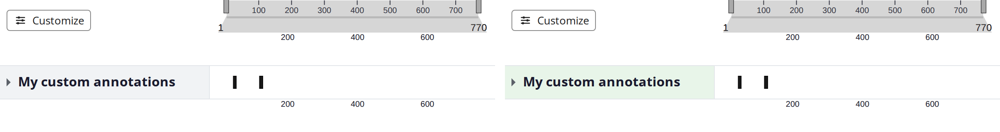

_The same viewer before and after a `theme:` block: default on the left, themed on the right._

`<protvista-uniprot>` exposes a documented styling API built on two
native web standards, so you can match the viewer to your application
with **plain CSS and no JavaScript**:

- **CSS custom properties** (`--protvista-*` design tokens) for colours,
  sizes and other themable values. This is the primary surface.
- **`::part`** for targeting structural elements of the shadow-DOM
  datatable (rows, cells, header, filter controls).

Overriding these is the supported way to customise the interface.
Internal class names (the hash-prefixed `.pv-*` classes) are **not** a
public API and may change between releases — theme through the tokens
and parts below instead.

## Why two mechanisms?

The main viewer and the structure panel render in the **light DOM**
(required by the embedded Mol\* structure viewer), so their themable
values are exposed as custom properties, which you set on the element or
any ancestor. The datatable renders in a **shadow root**, so in addition
to custom properties (which pierce the boundary through inheritance) it
also exposes `::part` hooks for structural styling that a custom
property alone can't express.

## Quick start

```css
/* Theme every ProtVista instance on the page. */
:root {
  --protvista-color-accent: #7b2d8e;
  --protvista-group-label-bg: #efe6f5;
  --protvista-radius: 8px;
}

/* Theme one instance. */
protvista-uniprot#my-viewer {
  --protvista-track-label-bg: #f2f2f2;
}

/* Reach into the datatable's shadow DOM with ::part. */
protvista-uniprot-datatable::part(row-active) {
  outline: 2px solid #7b2d8e;
}
```

Because tokens are ordinary custom properties, they are also settable at
runtime — `element.style.setProperty('--protvista-color-accent', …)` —
which is how an interactive controls panel can drive live theming. A
runtime override survives a later `setConfig()`: a config `theme:` clears
only the tokens its own previous apply wrote, never one you set yourself.
The one exception is a token the previous `theme:` *did* write — if you
overwrite one of those by hand, the next apply clears it along with the
rest of that theme's output. Set such a value through the config
`theme:`, or re-apply it after `setConfig()`.

## No-code theming from the config

For authors who don't write CSS, a subset of the chrome colours can be set
directly in the viewer config via the optional top-level `theme:` block:

```yaml
theme:
  labelColor: '#e8f5e9' # tints the row-label panel: groups get the colour, tracks a lighter tint
  accentColor: '#0053d6' # focus rings + datatable active-row marker
```

The component applies each as the matching `--protvista-*` custom property
**inline on the host element** at mount. Because an inline declaration
beats both the `:where(:root)` default and ordinary page CSS (an inherited
`:root` value or an element-selector rule), a config `theme` **takes
precedence over page CSS**: a host that needs to override a config-supplied
theme must use `!important` (e.g. `protvista-uniprot { --protvista-color-accent: #7b2d8e !important }`)
or set the token inline on the element itself.

`theme.labelColor` is a one-colour tint that keeps the shipped hierarchy:
it becomes `--protvista-group-label-bg`, and `--protvista-track-label-bg`
is derived as a light tint of it (25% of your colour over white) — the
default grey/white group-vs-track pair, in your hue. To pin
either surface exactly, set the explicit fields, which override the
derived pair and map one-to-one onto the same tokens:

```yaml
theme:
  groupLabelColor: '#c8e6c9' # exact group-label background
  trackLabelColor: '#ffffff' # exact track-label background
```

`theme.accentColor` maps to `--protvista-color-accent`. For anything beyond
these — or when the *page* should win over the config — use the CSS tokens
directly and don't set `theme` in the config.

### A themed label brings its own text colour

A background is only half a surface, so the `theme:` block does not stop at
one. For each label surface it paints, the component measures the colour
and derives the rest to match:

| Derived | Token |
| --- | --- |
| Text, whichever of the default body colour and white contrasts better | `--protvista-group-label-color`, `--protvista-track-label-color` |
| Muted text for hidden/dataless rows in customize mode | `--protvista-group-label-color-muted`, `--protvista-track-label-color-muted` |
| The group's collapse caret | `--protvista-caret-color` |
| The group's hover background | `--protvista-group-label-hover-bg` |

This is why a dark `labelColor` stays readable: the label text flips to
white rather than staying near-black on a near-black fill, and the caret
and hover state follow it instead of dropping out. The component always
picks the better of the two candidates, but it cannot manufacture
contrast a colour doesn't have: a mid-tone grey near `#808080` sits too
close to both black and white for any text to clear the AA threshold, so
prefer colours that are decisively light or dark. Set any of these tokens
in your own CSS with `!important` if you want a different answer — the
config theme writes them inline (see the precedence note above).

Colour values are resolved to `rgb()` before they reach the stylesheet.
Hex, keywords, `rgb()`, `hsl()` and `hwb()` are resolved by the browser;
`oklch()`, `oklab()`, `lab()`, `lch()` and `color()` in the `srgb`,
`srgb-linear` and `display-p3` spaces are converted by the viewer itself,
so they work even on browsers in the support matrix that cannot parse
them. A colour outside the sRGB gamut is clamped per channel rather than
gamut-mapped.

A value that doesn't resolve — a typo, or a colour space not in the list
above — is ignored with a `console.warn`, leaving the token at its
default; an explicit `groupLabelColor` / `trackLabelColor` that doesn't
resolve falls back to what `labelColor` would have given. `accentColor`
keeps any alpha you give it, because nothing is derived from it; a label
colour is composited over the surface first, since its text colour is
chosen against the result. The derivation always composites over the
shipped white surface, so if your page repaints
`--protvista-color-surface` to something dark, set the label tokens
directly rather than theming through the config.

## Design tokens

Every token has a sensible default (shown below), so a viewer with no
custom CSS renders exactly as it always has. Component tokens whose
default is written as `var(--protvista-…)` inherit from the global tier,
so overriding one global token (e.g. `--protvista-color-text`) cascades
everywhere it is used — wherever you declare it, including on the host
element or an ancestor rather than on `:root`. Setting the component
token itself always wins over the global it defaults from.

### Global

| Token | Type | Default | Purpose |
| --- | --- | --- | --- |
| `--protvista-font-family` | font | `inherit` | Base font family for viewer chrome. |
| `--protvista-font-size` | length | `0.8rem` | Base font size for viewer chrome. |
| `--protvista-color-accent` | color | `#0053d6` | Accent — focus rings, active-row marker, primary UI. |
| `--protvista-color-text` | color | `#222222` | Default body text colour. |
| `--protvista-color-text-muted` | color | `#4a5056` | Muted/secondary text (tooltip labels, captions). |
| `--protvista-color-surface` | color | `#ffffff` | Surface/background for popovers, panels, and (by default) the neutral viewer chrome cells. |
| `--protvista-color-border` | color | `#c5c8cc` | Default border for popovers and panels. |
| `--protvista-color-disabled` | color | `#808080` | Disabled controls. |
| `--protvista-color-bg-hover` | color | `#f1f7ff` | Background of hovered interactive chrome (buttons, list rows). |
| `--protvista-color-bg-active` | color | `#e6f3ff` | Background of an active/pressed control (toggle buttons). |
| `--protvista-radius` | length | `4px` | Corner radius for popovers and controls. |
| `--protvista-shadow-popover` | shadow | `0 4px 12px rgb(0 0 0 / 0.15)` | Drop shadow for floating popovers. |

### Viewer (labels, navigation, empty states)

> **Setting a label background in your own CSS?** Set its text colour
> too. The contrast derivation described above runs only for the config
> `theme:` path — CSS cannot choose the readable one of two candidates,
> and `color-mix()` is outside this package's browser support matrix. So
> if you set `--protvista-group-label-bg` or `--protvista-track-label-bg`
> to something dark, also set the matching `--protvista-*-label-color`
> and `--protvista-*-label-color-muted`, plus `--protvista-caret-color`
> and `--protvista-group-label-hover-bg` for a group label. Otherwise the
> text stays at the near-black default and disappears into the fill.

The label tokens cover the **data rows only**. The two cells that bracket
them — the navigation label cell above and the credits cell below — are
neutral chrome rather than rows, so they stay put when you retint the
label column; tinting them made a label colour bleed above and below the
rows it describes. They have their own pair,
`--protvista-chrome-cell-bg` / `--protvista-chrome-cell-color`, which
default from the global surface and text so an untouched viewer is
unchanged. If you want the whole column in one colour, set that pair —
retinting `--protvista-color-surface` instead would repaint every
popover, tooltip and panel on the page too. The split is **backgrounds
only** — all four cells take their text colour from a token, so the
column never shows two text colours at once.

| Token | Type | Default | Purpose |
| --- | --- | --- | --- |
| `--protvista-track-content-width` | length | `80vw` | Width of the track-content (visualisation) column. |
| `--protvista-label-width` | length | `20vw` | Width of the label column (group/track/nav labels, credits). |
| `--protvista-group-label-bg` | color | `#f1f3f5` | Background of collapsible group labels. |
| `--protvista-group-label-hover-bg` | color | `var(--protvista-color-bg-hover)` | Background of a hovered collapsible group label. |
| `--protvista-track-label-bg` | color | `#ffffff` | Background of individual track labels. |
| `--protvista-group-label-color` | color | `var(--protvista-color-text)` | Text colour of collapsible group labels. |
| `--protvista-track-label-color` | color | `var(--protvista-color-text)` | Text colour of individual track labels. |
| `--protvista-group-label-color-muted` | color | `var(--protvista-color-text-muted)` | Recessive text on a group label — a hidden/dataless group in customize mode. |
| `--protvista-track-label-color-muted` | color | `var(--protvista-color-text-muted)` | Recessive text on a track label — a hidden/dataless track in customize mode. |
| `--protvista-chrome-cell-bg` | color | `var(--protvista-color-surface)` | Background of the neutral chrome cells in the label column (navigation label, credits) — the cells that bracket the data rows without being one. |
| `--protvista-chrome-cell-color` | color | `var(--protvista-color-text)` | Text colour of the neutral chrome cells in the label column. |
| `--protvista-track-border-color` | color | `#e3e6ea` | Hairline ruling the viewer grid: between rows, and between the label column and the track area. |
| `--protvista-caret-color` | color | `#5b6169` | Group-label expand/collapse caret. |
| `--protvista-nav-handle-fill` | color | `darkgrey` | Fill of the navigation zoom handles. |
| `--protvista-nav-handle-stroke` | color | `black` | Stroke of the navigation zoom handles. |
| `--protvista-no-results-bg` | color | `#e4e8eb` | Background of the "no results" empty state. |

### Tooltip

| Token | Type | Default | Purpose |
| --- | --- | --- | --- |
| `--protvista-tooltip-bg` | color | `var(--protvista-color-surface)` | Tooltip background. |
| `--protvista-tooltip-color` | color | `var(--protvista-color-text)` | Tooltip text colour. |
| `--protvista-tooltip-border` | color | `var(--protvista-color-border)` | Tooltip border and arrow colour. |
| `--protvista-tooltip-max-width` | length | `320px` | Maximum tooltip width before text wraps. |

### Datatable

| Token | Type | Default | Purpose |
| --- | --- | --- | --- |
| `--protvista-datatable-accent` | color | `var(--protvista-color-accent)` | Accent — focus outline, active-row marker. |
| `--protvista-datatable-text-head` | color | `#1a1a1a` | Header-cell text colour. |
| `--protvista-datatable-text-body` | color | `#2c2c2c` | Body-cell text colour. |
| `--protvista-datatable-text-muted` | color | `#444444` | Muted text (e.g. the no-results message). |
| `--protvista-datatable-text-input` | color | `#333333` | Filter `<select>` text colour. |
| `--protvista-datatable-bg-base` | color | `var(--protvista-color-surface)` | Datatable base background. |
| `--protvista-datatable-bg-header` | color | `#f8f8f8` | Sticky header-row background. |
| `--protvista-datatable-bg-hover` | color | `#f1f7ff` | Row hover/focus background. |
| `--protvista-datatable-bg-active` | color | `#e6f3ff` | Selected/active-row background. |
| `--protvista-datatable-border` | color | `#e0e0e0` | Cell and container borders. |
| `--protvista-datatable-border-input` | color | `#767676` | Filter `<select>` border. |
| `--protvista-datatable-shadow-header` | color | `#cccccc` | Under-shadow of the sticky header row. |
| `--protvista-datatable-max-height` | length | `400px` | Max height of the scroll container before it scrolls. |

> **Migrating from `--protvista-dt-*`:** the datatable tokens were
> previously named `--protvista-dt-*`. Those names still work as aliases
> for one major cycle — an existing `--protvista-dt-primary` override, for
> example, is honoured by `--protvista-datatable-accent` — but new code
> should use the `--protvista-datatable-*` names. If both are set, the
> `--protvista-datatable-*` one wins.

The datatable renders in a shadow root, but its tokens are set the same
way as every other token on this page: on `:root`, on an ancestor, on the
`<protvista-uniprot-datatable>` element, or inline. Custom properties
inherit through the shadow boundary, so no `::part` or `!important` is
needed to retheme it.

## Datatable `::part`

The datatable (`<protvista-uniprot-datatable>`, used inside the
structure panel) exposes these parts:

| Part | Element |
| --- | --- |
| `scroll-container` | The scrolling wrapper around the table. |
| `table` | The `<table>` element. |
| `header` | The `<thead>` header section. |
| `header-cell` | Each header `<th>`. |
| `filter-select` | Each column filter `<select>`. |
| `row` | Every body row. |
| `row-active` | The selected row (in addition to `row`). |
| `cell` | Every body `<td>`. |
| `no-results` | The empty-state cell shown when a filter matches nothing. |

```css
protvista-uniprot-datatable::part(header) {
  background: #1a1a2e;
  color: #fff;
}
protvista-uniprot-datatable::part(row):hover {
  background: #fff7e6;
}
```

## What is *not* themable here

Data-domain colours — the AlphaFold pLDDT and AlphaMissense pathogenicity ramps, and variant/PTM colours — are semantic data encodings, not interface chrome, so they're themed through the viewer configuration (`registerTheme()` / rendering presets) instead of these tokens. Nightingale track internals are also out of scope: the track canvases are rendered by the upstream `@nightingale-elements/*` components, so only the properties those components choose to expose can be set from here.

## On the roadmap

Dark mode is planned as a `prefers-color-scheme` default token set — the token layer above is the substrate, and the palette itself is the follow-on work. Colour-blind-friendly palettes are part of the viewer's WCAG accessibility work and will likewise be a token-swap on top of this layer. Further out, the interactive playground should grow a no-code styling panel that lets non-developers adjust these tokens with live preview.

_Licensed under [CC BY 4.0](https://creativecommons.org/licenses/by/4.0/)._
